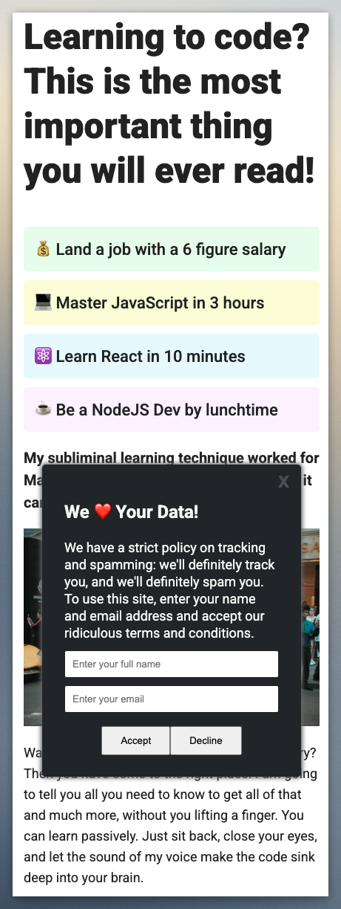

# Cookie Consent Modal


A humorous cookie consent modal that demonstrates DOM manipulation and form handling with vanilla JavaScript.




## Table of Contents

- [Features](#features)
- [Demo](#demo)
- [Installation](#installation)
- [Usage](#usage)
- [Project Structure](#project-structure)
- [Technologies Used](#technologies-used)
- [Contributing](#contributing)
- [License](#license)
- [Acknowledgements](#acknowledgements)

## Features

- Timed appearance of cookie consent modal
- Form validation for name and email
- Humorous interactive elements and animations
- Responsive design
- Dark-themed modal with clean UI

## Demo

The cookie consent modal appears shortly after the page loads and demonstrates:
- Form submission handling
- Loading states with animations
- Interactive button behavior (try hovering over the decline button!)
- Simulated data submission process

## Installation

1. Clone the repository:
```bash
git clone https://github.com/bakadja/cookie-consent.git
cd cookie-consent
```

2. Install dependencies:
```bash
npm install
```

## Usage

Start the development server:
```bash
npm start
# or
npm run dev
```

The application will be available at `http://localhost:5173/`

Build for production:
```bash
npm run build
```

Preview the production build:
```bash
npm run preview
```

## Project Structure

```
cookie-consent/
├── images/             # Image assets
├── index.html          # Main HTML file
├── index.css           # Styles
├── index.js            # JavaScript functionality
├── package.json        # Project dependencies
└── vite.config.js      # Vite configuration
```

## Technologies Used

- HTML5
- CSS3
- Vanilla JavaScript
- [Vite](https://vitejs.dev/) - Frontend build tool

## Contributing

Contributions are welcome! Please feel free to submit a Pull Request.

1. Fork the repository
2. Create your feature branch (`git checkout -b feature/amazing-feature`)
3. Commit your changes (`git commit -m 'Add some amazing feature'`)
4. Push to the branch (`git push origin feature/amazing-feature`)
5. Open a Pull Request

## License

This project is licensed under the MIT License - see the LICENSE file for details.

## Acknowledgements

- [Vite](https://vitejs.dev/) for the lightning-fast build tool
- [Scrimba](https://scrimba.com/) for educational resources
- Font icons by [Google Fonts](https://fonts.google.com/)

---
